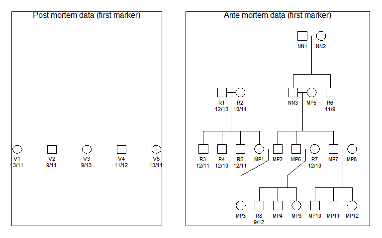

<!-- README.md is generated from README.Rmd. Please edit that file -->

```{r, echo = FALSE}
knitr::opts_chunk$set(
  collapse = TRUE,
  comment = "#>",
  fig.path = "man/figures/README-"
)
```


# The dvir (Disaster Victim Identification) library

DNA profiles are available from victims (post mortem, pm, data) and 
reference families (ante mortem, am, data) with missing persons (mp-s). The problem 
is to identify the mp-s. Some (or all) victims may not be 
among the mp-s. Similarly, there may be mp-s not in the list of victims.
A search strategy
is implemented. All victims are initially tried, one at a time, in all mp positions.
Results are sorted according to the likelihood and moves with a LR (compared to the null
likelihood) below a user specified limit are omitted from further search. If mutations are 
modelled all LR-s will typically be positive and the limit must be specified to a negative number
to include all possibilities in the future search. Based on this initial screening, all possible moves
of victims are generated. Note that only a subset, possibly none, of victims may be mapped to mp-s.
The resulting list of moves may be prohibitively large and for this reason it possible to restrict the search by
specifying that only the `nbest` moves for each victim be considered.

In addition, a forward stepwise approach, conceptually similar to variable selection in regression analysis, is implemented in the function `forward`. This approach is generally faster, but may fail to find a solution.

## Installation

To get the lastest version, install from GitHub as follows:

```{r, eval = FALSE}
 # First install devtools if needed
if(!require(devtools)) install.packages("devtools")

# Install mut2 from GitHub
devtools::install_github("thoree/dvir")
```
The implementation relies heavily on 
the `pedtools` suite of R-libraries, in particular the `forrel` and `pedmut`
libraries
which can be installed by running

```{r, eval = FALSE}
devtools::install_github("magnusdv/forrel")
devtools::install_github("magnusdv/pedmut")
```
                        

## Example 1

The data is simulated and summarised by the below figure

##  

One of the 13 CODIS, TPOX, is included in the plot. Five
victims are shown to the left. The reference families are
on the right hand side. Based on this marker, we see for instance that the only possibility for `MP3` is `V3` as mutations are disregarded initially in this example.
The data has been prepared,loaded and the first part of analysisis given below:

```{r example1, message = FALSE}
library(dvir)
library(forrel)
data(dvi.data)
from = dvi.data$pm
to = dvi.data$am
ids.from = dvi.data$vict
ids.to = dvi.data$miss
tab = reduce(from, to, ids.from, ids.to, limit = 0)
tab
```

The data is plotted with the irst twomarkers below

```{r plot, message = FALSE}
plotPedList(list(from,to), newdev = TRUE, marker = 1:2,
            skip.empty.genotypes = TRUE, dev.width = 7, dev.height = 2,
            frametitles = c("Post mortem data (first marker)", 
                            "Ante mortem data (first marker)"))
```

The null likelihood, `lik0`=2.625697e-132 is the
likelihood prior to any attempt of identification. This can also be calculated directly 
using only the `forrel`library

```{r message = FALSE, eval = TRUE}
prod(forrel::LR(list(from, to), 1)$likelihoodsPerSystem)
```

The above table shows that all victims can be assigned a mp. For `V3` there
are two possibilities and these are ranked.
Based on the table, all possible solutions are generated and evaluated
and the three best solutions are shown below

```{r message = FALSE, eval = TRUE}
res2 = dviSearch(from, to,  ids.from, ids.to,  nbest = NULL, extend = TRUE)
res2[1:3,]
```

The first line gives the optimal solution and corresponds to the one from which
data was simulated:`MP1 = V1`, `MP2 = V2`, `MP3 = V3`.
The second line differs by not identifying `V1`.
In this case, there is no need to limit the search.
However, for large problems, the variable `nbest`can as mentioned be used to limit the search
to the  `nbest` options for each victim. If `extend = FALSE` alle victims must be among the missing persons.

### Mutations

Next the data is modified to allow for mutations, a `proportional` mutation model
with mutation rate 0.005. 
The identification `MP3 = V1` is no longer excluded and likelihoods are slightly changed.
The three best solutions are

```{r message = FALSE, eval = TRUE, echo = FALSE}
library(pedmut)
r = 0.005
for (j in 1:5){
  m = from[[j]]$markerdata
  mm = lapply(m, function(x) {mutmod(x) = mutationModel("proportional", 
                            alleles = alleles(x),
                            afreq = afreq(x), rate = r); x})
  g = getAlleles(from[[j]])
  from[[j]] = setMarkers(from[[j]], m = mm, allele_matrix = g)
}

for (j in 1:2){
  m = to[[j]]$markerdata
  mm = lapply(m, function(x) {mutmod(x) = mutationModel("proportional", 
                            alleles = alleles(x),
                            afreq = afreq(x), rate = r); x})
  g = getAlleles(to[[j]])
  to[[j]] = setMarkers(to[[j]], m = mm, allele_matrix = g)
}
```


```{r mut, message = FALSE, echo=FALSE}
tab = reduce(from, to, ids.from, ids.to, limit = -1)
```


```{r message = FALSE, eval = TRUE}
res = dviSearch(from, to,  ids.from, ids.to,  nbest = NULL, extend = TRUE, limit = -1)
res[1:3,]
```

### Simulation

First victims are simulated as unrelated:

```{r message = FALSE, eval = TRUE}
from = setAlleles(from, alleles =0)
nsim = 100
sim = profileSim(c(from, to), N = nsim, ids = ids.from, 
                      conditions = 1:13,seed = 123)
res = list()
for (i in 1:nsim)
  res[[i]] = dviSearch(sim[[i]][1:5], sim[[i]][6:7],  
             ids.from, ids.to,  nbest = NULL, extend = TRUE)
```

Next victims are simulated as `MP1`,`MP2` and `MP3`.

```{r message = FALSE, eval = TRUE}
from = setAlleles(from, alleles = 0, ids = ids.from[1:3])
sim = profileSim(c(from, to), N = 1, ids = ids.to, 
                      conditions = 1:13, seed = 123)[[1]]
g = getAlleles(sim, ids = ids.to)
sim = setAlleles(sim, ids = ids.to, alleles = 0)
rownames(g) = ids.from[1:3]
sim = setAlleles(sim, ids = rownames(g), alleles = g)
dviSearch(sim[1:5], sim[6:7],  ids.from, ids.to,  nbest = NULL, extend = TRUE)[1:3,]
```

## Example 2 

The case is  summarised by the below figure

##  

The data has been prepared,loaded and the analysis is given below:

```{r example11, message = FALSE}
library(dvir)
library(forrel)
data(dvi.nfi)
from = dvi.nfi$pm
to = dvi.nfi$am
ids.from = dvi.nfi$vict
ids.to = dvi.nfi$miss
#tab1 = reduce(from, to, ids.from, ids.to, limit = 0)
tab2 = dviSearch(from, to, ids.from, ids.to, limit = 1, nbest = 2, extend = T)
```

### Mutation

```{r message = FALSE, eval = TRUE, echo = FALSE}
library(pedmut)
r = 0.005
for (j in 1:5){
  m = from[[j]]$markerdata
  mm = lapply(m, function(x) {mutmod(x) = mutationModel("proportional", 
                            alleles = alleles(x),
                            afreq = afreq(x), rate = r); x})
  g = getAlleles(from[[j]])
  from[[j]] = setMarkers(from[[j]], m = mm, allele_matrix = g)
}

  m = to$markerdata
  mm = lapply(m, function(x) {mutmod(x) = mutationModel("proportional", 
                            alleles = alleles(x),
                            afreq = afreq(x), rate = r); x})
  g = getAlleles(to)
  to = setMarkers(to, m = mm, allele_matrix = g)
  tab3 = dviSearch(from, to, ids.from, ids.to, limit = 1, nbest = 1, extend = T)
```

## Example
```{r message = FALSE, eval = TRUE, echo = FALSE}
als = 1:3
p = c(0.1, 0.4,0.5)
amat = rbind(c(1,1), c(2,2), c(1,2))
from = singletonList(3, amat = amat, als= als, freq = p)
ids.from = unlist(lapply(from, function(x) x$ID))
to = linearPed( 2)
m = marker(to, alleles =als, afreq = p, "2" = 1)
to = addMarkers(to, m)
ids.to = c("MP1", "MP2", "MP3")
to = relabel(to, c("MP1", "MO1", "MP2", "MO2", "MP3"))
plotPedList(list(from, to), marker = 1, newdev = F, skip.empty.genotypes = T)
LRlimit = -1
eliminate = TRUE
singleStep = TRUE
twoStep = TRUE
res = forward(from, to, ids.from, ids.to, LRlimit = LRlimit,
              eliminate = eliminate, singleStep =singleStep,
              twoStep = twoStep)
res[[1]]
res2 = dviSearch(from, to, ids.from, ids.to, limit = LRlimit)
res2[1:5,]

```

## Example: Data input

In this example data is inputted from scratch in R.
Note that `V2` does not exceed LR for any move, but still enters into the optimal solution.

```{r message = FALSE, eval = TRUE, echo = FALSE}
als = 1:5
p = 1:length(als)
p = p/sum(p)
ids.from = c("V1", "V2", "V3")
v1 = singleton("V1")
m = marker(v1, "V1" = 1, alleles = als, afreq = p)
v1 = addMarkers(v1, m)
v2 = singleton("V2")
m = marker(v2, "V2" = 2, alleles = als, afreq = p)
v2 = addMarkers(v2, m)
v3 = singleton("V3")
m = marker(v3, "V3" = c(1,2), alleles = als, afreq = p)
v3 = addMarkers(v3, m)
from = list(v1, v2, v3)
to = nuclearPed(3)
to = relabel(to, c("M1", "MO", "R1", "M2", "M3"))
m = marker(to, alleles = als, afreq = p, "R1" = 1)
to = addMarkers(to, m)
ids.to = c("M1", "M2", "M3")
plotPedList(list(from, to), marker = 1)
res1 = reduce(from, to, ids.from, ids.to, limit = -1)
res1
res2 = dviSearch(from, to, ids.from, ids.to, limit = -1)
res2[1:5,]
```
