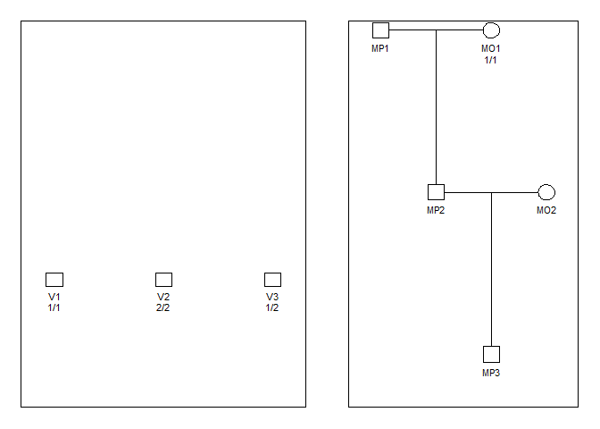

<!-- README.md is generated from README.Rmd. Please edit that file -->

# The dvir (Disaster Victim Identification) library

We assume DNA profiles are available from victim samples (post mortem,
pm data) and reference families (ante mortem, am, data) with missing
persons (MP-s). There may be several samples from the same victim,
potentially of low quality leading to *drop-outs*. The problem is to
identify the MP-s. Some (or all) victims may not be among the MP-s.
Similarly, there may be MP-s not in the list of victims. A search
strategy is implemented. All victims are initially tried, one at a time,
in all MP positions. Results are sorted according to the likelihood and
assignments with a LR (compared to the null likelihood) below a user
specified limit are omitted from further search. If mutations are
modelled all LR-s will typically be positive and the limit must be
specified to a negative number to include all possibilities in the
future search. Based on this initial screening, all possible assignments
of victims are generated. Note that only a subset, possibly none, of
victims may be mapped to MP-s. The resulting list of assignments may be
prohibitively large and for this reason it possible to restrict the
search by specifying that only the `nbest` assignments for each victim
be considered.

## Installation

To get the latest version, install from GitHub as follows:

``` r
 # First install devtools if needed
if(!require(devtools)) install.packages("devtools")

# Install dvir from GitHub
devtools::install_github("thoree/dvir")
```

The implementation relies heavily on the `ped suite` of R-libraries, in
particular `forrel` and `pedmut`. These are automatically installed by
the above command.

## Load libraries

``` r
library(dvir)
```

## Example 1

We consider the following example

``` r
library(pedtools)
n = 7
ids.from = paste("V", 1:n, sep = "")
sex = c(rep(1, n-1), 2)
df = data.frame(id = ids.from, fid = 0, mid = 0, sex = sex,
                a1 = c(1,2,1,1,2,2,2),
                a2 = c(1,2,1,1,2,2,2))
locus_annotations = list(alleles = 1:3, afreq = c(1, 1, 1)/3)
from = as.ped(df, locusAttributes = locus_annotations)
to = nuclearPed(3, father = "R1", mother = "R2", children= c("MP1","MP2","MP3"))
m = marker(to, "R1" = 1, "R2" = 1,   alleles = 1:3, afreq = c(1, 1, 1)/3, name = "a1")
to = addMarkers(to, m)
plotPedList(list(from, to), marker = 1, 
            titles = c("PM data. 7 victims", "AM data. 3 MP-s"))
```

<!-- -->

We do not consider mutations or other artefacts. We assume that copies
of victim samples have been identified and merged so that without extra
information like (*todo:* add age), there are six symmetric solutions.
If we knew the age ordering, for instance
\(age(V1) > age(V2) > age(V3)\), then \(MP1=V1, MP2=V2, MP3=V3\).
Recall, the convention that individuals are ordered left to right in the
pedigree based on age.

### The number of assignments

The number of assignments is

``` r
m = ncomb(1,0,6,3)
m
#> [1] 229
```

as is checked by

``` r
MPs = c("MP1", "MP2","MP3")
# see function generateMoves below
moves = list(V1 = c("V1", MPs ), V2 = c("V2", MPs ), V3 = c("V3", MPs ), V4 = c("V4", MPs),
             V5 = c("V5", MPs ), V6 = c("V6", MPs ), V7 = "V7" )
a = expand.grid.nodup(moves)
stopifnot(length(a) == m)
```

### The search

The search and the ten best solutions among all possible

``` r
res = global(from, to, MPs, moves = NULL, limit = -1, verbose = F)
res[1:10,]
#>    V7  V1 V2  V3  V4 V5 V6    loglik  LR  posterior
#> 43 V7 MP3 V2 MP2 MP1 V5 V6 -13.18335 729 0.12326682
#> 46 V7 MP2 V2 MP3 MP1 V5 V6 -13.18335 729 0.12326682
#> 56 V7 MP3 V2 MP1 MP2 V5 V6 -13.18335 729 0.12326682
#> 59 V7 MP1 V2 MP3 MP2 V5 V6 -13.18335 729 0.12326682
#> 69 V7 MP2 V2 MP1 MP3 V5 V6 -13.18335 729 0.12326682
#> 72 V7 MP1 V2 MP2 MP3 V5 V6 -13.18335 729 0.12326682
#> 15 V7 MP2 V2 MP1  V4 V5 V6 -15.38057  81 0.01369631
#> 16 V7 MP3 V2 MP1  V4 V5 V6 -15.38057  81 0.01369631
#> 22 V7 MP1 V2 MP2  V4 V5 V6 -15.38057  81 0.01369631
#> 23 V7 MP3 V2 MP2  V4 V5 V6 -15.38057  81 0.01369631
```

We can start by limiting the search. First all sex consistent marginal
moves are generated.

``` r
moves = generateMoves(from, to, MPs)
```

We only keep two best marginal candidates

``` r
moves2 = marginal(from, to,  MPs, moves, limit = -1, sorter = T,  nkeep = 3)
res = global(from, to, MPs, moves = moves2[[1]], limit = -1, verbose = F)
res[1:6,]
#>   V7  V1 V2  V3  V4 V5 V6    loglik  LR posterior
#> 1 V7 MP3 V2 MP2 MP1 V5 V6 -13.18335 729 0.1666667
#> 2 V7 MP2 V2 MP3 MP1 V5 V6 -13.18335 729 0.1666667
#> 3 V7 MP3 V2 MP1 MP2 V5 V6 -13.18335 729 0.1666667
#> 4 V7 MP1 V2 MP3 MP2 V5 V6 -13.18335 729 0.1666667
#> 5 V7 MP2 V2 MP1 MP3 V5 V6 -13.18335 729 0.1666667
#> 6 V7 MP1 V2 MP2 MP3 V5 V6 -13.18335 729 0.1666667
```

## Example 2

We next consider a larger example data. First the data is loaded:

``` r
con <- url("http://familias.name/BookKETP/Files/Grave.RData") 
load(con) 
close(con) # Finished loading data: from, to, ids.to and moves
rm(con)
```

The family with the missing persons MP1-MP8 and references R1-R5, the
genotyped family members, is shown below

``` r
labnew = labels(to)
labnew[c(1:5,7:8,16,20:21)] = " "
refs = paste("R", 1:5, sep = "")
mps = paste("MP", 1:8, sep ="")
plot(to,labs = labnew,  aff = c(refs, mps),
     col = list( red = refs, blue = mps), deceased = mps,
     title = "AM data")
```

<!-- -->

The variable `from` is a list of singletons with female victims V1, V3,
V4, V5, V6 and male victims V2, V7, V8. The apriori possible number of
assignments ignoring symmetries is

``` r
ncomb(5, 5, 3, 3)
#> [1] 52564
```

We restrict the number of assignments by requiring \(LR > 0.99\) for
*marginal* moves. For instance, based on the below, the possibility `V1
= MP1` will be considered since the \(LR\) comparing the assignment `V1
= MP1, no more victims identified` to the null hypotheses, `none
identified`, exceeds 0.99.

``` r
moves = generateMoves(from, to, ids.to)
m = marginal(from , to, ids.to, limit = 0.99, moves = moves,  sorter = T)
m[[1]]
#> $V1
#> [1] "MP1" "V1" 
#> 
#> $V3
#> [1] "MP3" "V3" 
#> 
#> $V4
#> [1] "MP4" "MP5" "V4" 
#> 
#> $V5
#> [1] "MP4" "MP5" "V5" 
#> 
#> $V6
#> [1] "MP6" "V6" 
#> 
#> $V2
#> [1] "MP2" "V2" 
#> 
#> $V7
#> [1] "MP7" "MP8" "V7" 
#> 
#> $V8
#> [1] "V8"
```

Based on the corresponding LRs below, we realise that `limit = 0` would
be a better option, since the only additions are `V8 = MP8`and `V2 =
MP8`

``` r
m[[2]]
#> [[1]]
#>       MP1        V1       MP3       MP4       MP5       MP6 
#> 479971259         1         0         0         0         0 
#> 
#> [[2]]
#>          MP3           V3          MP1          MP4          MP5          MP6 
#> 6.409841e+14 1.000000e+00 0.000000e+00 0.000000e+00 0.000000e+00 0.000000e+00 
#> 
#> [[3]]
#>        MP4        MP5         V4        MP1        MP3        MP6 
#> 1.8036e+12 1.8036e+12 1.0000e+00 0.0000e+00 0.0000e+00 0.0000e+00 
#> 
#> [[4]]
#>          MP4          MP5           V5          MP1          MP3          MP6 
#> 103006682220 103006682220            1            0            0            0 
#> 
#> [[5]]
#>          MP6           V6          MP1          MP3          MP4          MP5 
#> 8.817392e+12 1.000000e+00 0.000000e+00 0.000000e+00 0.000000e+00 0.000000e+00 
#> 
#> [[6]]
#>          MP2           V2          MP8          MP7 
#> 6.776011e+10 1.000000e+00 5.512209e-01 0.000000e+00 
#> 
#> [[7]]
#>          MP7          MP8           V7          MP2 
#> 16946051.333      295.839        1.000        0.000 
#> 
#> [[8]]
#>       V8      MP8      MP2      MP7 
#> 1.000000 0.268489 0.000000 0.000000
```

However, changing to `limit = 0` considerably increases computation
time, I haven’t checked how much, but I rather use the list obtained
above:

``` r
res1 = global(from, to, ids.to, limit = 0.99, moves = m [[1]])
head(res1)
#>      V1  V3  V4  V5  V6  V2  V7 V8    loglik           LR    posterior
#> 5   MP1 MP3 MP4 MP5 MP6 MP2 MP7 V8 -737.0038 1.290829e+95 9.999998e-01
#> 149 MP1 MP3 MP4 MP5 MP6 MP2  V7 V8 -752.3418 2.816133e+88 2.181646e-07
#> 6    V1 MP3 MP4 MP5 MP6 MP2 MP7 V8 -768.7262 2.157791e+81 1.671632e-14
#> 53  MP1 MP3 MP4 MP5 MP6  V2 MP7 V8 -773.6762 1.528448e+79 1.184082e-16
#> 7   MP1  V3 MP4 MP5 MP6 MP2 MP7 V8 -774.0113 1.093148e+79 8.468571e-17
#> 9   MP1 MP3  V4 MP5 MP6 MP2 MP7 V8 -774.8047 4.944458e+78 3.830451e-17
```

We check the assignment with the identification MP8 = V8 added

``` r
res2 = global(from, to, ids.to, 
       moves = list(V1 = "MP1", V2 = "MP2", V3 = "MP3", V4 = "MP4",
                    V5 = "MP5", V6 = "MP6", V7 = "MP7", V8 = "MP8"))
res2
#>    V1  V2  V3  V4  V5  V6  V7  V8    loglik           LR posterior
#> 1 MP1 MP2 MP3 MP4 MP5 MP6 MP7 MP8 -737.8061 5.786551e+94         1
exp(res2$loglik-res1$loglik[1])
#> [1] 0.4482818
```

Finally, we would like to do an exhaustive search and the code is below.
Unfortunately, we may have to wait forever for the solution with the
current implementation

``` r
res3 = global(from, to, ids.to, moves = NULL)
head(res3)
```
