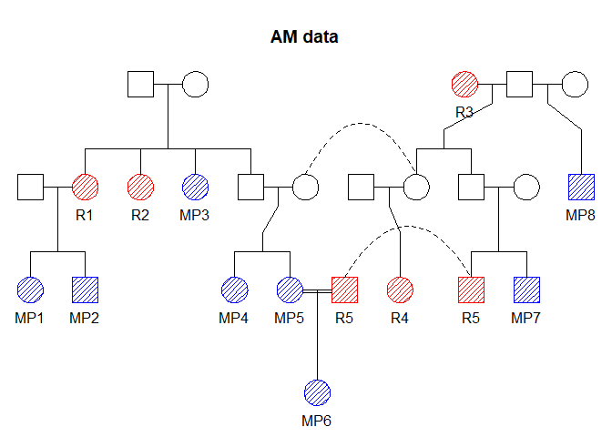

<!-- README.md is generated from README.Rmd. Please edit that file -->

# The dvir (Disaster Victim Identification) library

We assume DNA profiles are available from victim samples (post mortem,
pm data) and reference families (ante mortem, am data) with missing
persons (typically labelled M1, M2,…). <!-- There may be  -->
<!-- several samples from the same victim, potentially of low quality leading to *drop-outs*. -->
The problem is to identify the missing persons, the M-s. Some (or all)
victims may not be among the M-s. Similarly, there may be M-s not in the
list of victims. A search strategy is implemented. Results are sorted
according to the likelihood and likelihood ratios LR-s (compared to the
null likelihood) are reported. The number of assignments may be
prohibitively large and for this reason alternatives to an exhaustive
search are implemented.

## Installation

To get the latest version, install from GitHub as follows:

``` r
 # First install devtools if needed
if(!require(devtools)) install.packages("devtools")

# Install dvir from GitHub
devtools::install_github("thoree/dvir")
```

The implementation relies heavily on the `ped suite` of R-libraries, in
particular `forrel` and `pedmut`.

## Load libraries

We start by loading **dvir**. We also load **pedtools** for creating and
plotting pedigrees:

``` r
library(dvir)
library(pedtools)
```

## Example 1

We consider the following example

``` r
# Single marker with three equifrequent alleles
locAttr = list(name = "m", alleles = 1:3, afreq = c(1, 1, 1)/3)
# pm data. 7 victims named "V1", ..."V7"
n = 7
missing = paste0("V", 1:n)
sex = c(rep(1, n-1), 2)
df = data.frame(famid = missing, id = missing, fid = 0, mid = 0, sex = sex,
                m = c("1/1", "2/2", "1/1", "1/1", "2/2", "2/2", "2/2"))
pm = as.ped(df, locusAttributes = locAttr)

# am data. 
# Reference families, here one, with missing persons M1, M2, and M3
# and references "R1" and "R2"
MPs = c("M1", "M2", "M3")
am = nuclearPed(3, father = "R1", mother = "R2", children = MPs)
m = marker(am, "R1" = "1/1", "R2" = "1/1", name = "m")
am = setMarkers(am, m, locusAttributes = locAttr)
```

The DVI problem is summarised by the below figure:

``` r
# Plot both
plotPedList(list(pm, am), marker = 1, 
            hatched = typedMembers, 
            col = list(red = MPs), 
            titles = c("pm data. 7 victims", "am data. 3 M-s"))
```

<!-- -->

We do not consider mutations or other artefacts in this example. We
assume that copies of victim samples have been identified and merged.
Without extra information, like age data, there are six symmetric
solutions. If the ages are known, for instance age(V1) \> age(V2) \>
age(V3), there may a unique solution. Recall the convention that
individuals are ordered left to right in the pedigree based on age.

### The number of assignments

The number of possible assignments is:

``` r
ncomb(nVfemales = 1, nMPfemales = 0, nVmales = 6, nMPmales = 3)
#> [1] 229
```

The complete list of these assignments is generated as follows:

``` r
moves = generateMoves(pm, am, MPs)
a = expand.grid.nodup(moves)
head(a)
#>   V1 V2 V3 V4 V5 V6 V7
#> 1  *  *  *  *  *  *  *
#> 2  *  *  *  *  * M1  *
#> 3  *  *  *  *  * M2  *
#> 4  *  *  *  *  * M3  *
#> 5  *  *  *  * M1  *  *
#> 6  *  *  *  * M1 M2  *
```

### The search

The following search ranks all possible solutions by their likelihood.
The ten best solutions are shown.

``` r
res = jointDVI(pm, am, MPs, moves = NULL, limit = -1, verbose = F)
res[1:10, ]
#>    V1 V2 V3 V4 V5 V6 V7     loglik  LR  posterior
#> 1  M1  * M2 M3  *  *  *  -8.788898 729 0.12326682
#> 2  M1  * M3 M2  *  *  *  -8.788898 729 0.12326682
#> 3  M2  * M1 M3  *  *  *  -8.788898 729 0.12326682
#> 4  M2  * M3 M1  *  *  *  -8.788898 729 0.12326682
#> 5  M3  * M1 M2  *  *  *  -8.788898 729 0.12326682
#> 6  M3  * M2 M1  *  *  *  -8.788898 729 0.12326682
#> 7  M1  * M2  *  *  *  * -10.986123  81 0.01369631
#> 8  M1  * M3  *  *  *  * -10.986123  81 0.01369631
#> 9  M1  *  * M2  *  *  * -10.986123  81 0.01369631
#> 10 M1  *  * M3  *  *  * -10.986123  81 0.01369631
```

## Example 2

We next consider a larger dataset, loaded as follows:

``` r
load(url("http://familias.name/BookKETP/Files/Grave.RData"))
pm = from
am = to
```

The family `am` has 8 missing persons, labelled MP1-MP8, and 5 genotyped
family members, labelled R1-R5. The pedigree is shown below.

``` r
refs = paste0("R", 1:5)
missing = paste0("MP", 1:8)
plot(am, title = "AM data", labs = c(refs, missing), hatched = c(refs, missing), 
     col = list(red = refs, blue = missing), deceased = missing)
```

<!-- -->

The list of singletons in `pm` contains female victims V1, V3, V4, V5,
V6, and male victims V2, V7, V8. The *a priori* possible number of
assignments, ignoring symmetries, is

``` r
ncomb(nVfemales = 5, nMPfemales = 5, nVmales = 3, nMPmales = 3)
#> [1] 52564
```

We first do a single search

``` r
m = singleSearch(pm, am, missing)
m$LR.table
#>          MP1         MP2          MP3          MP4          MP5          MP6
#> V1 479971259           0 0.000000e+00 0.000000e+00 0.000000e+00 0.000000e+00
#> V2         0 67760107189 0.000000e+00 0.000000e+00 0.000000e+00 0.000000e+00
#> V3         0           0 6.409841e+14 0.000000e+00 0.000000e+00 0.000000e+00
#> V4         0           0 0.000000e+00 1.803600e+12 1.803600e+12 0.000000e+00
#> V5         0           0 0.000000e+00 1.030067e+11 1.030067e+11 0.000000e+00
#> V6         0           0 0.000000e+00 0.000000e+00 0.000000e+00 8.817392e+12
#> V7         0           0 0.000000e+00 0.000000e+00 0.000000e+00 0.000000e+00
#> V8         0           0 0.000000e+00 0.000000e+00 0.000000e+00 0.000000e+00
#>         MP7         MP8
#> V1        0   0.0000000
#> V2        0   0.5512209
#> V3        0   0.0000000
#> V4        0   0.0000000
#> V5        0   0.0000000
#> V6        0   0.0000000
#> V7 16946051 295.8389523
#> V8        0   0.2684890
```

We next perform the search:

``` r
res1 = jointDVI(pm, am, missing, limit = 0, numCores = 4)
head(res1)
#>    V1  V2  V3  V4  V5  V6  V7  V8    loglik           LR    posterior
#> 1 MP1 MP2 MP3 MP4 MP5 MP6 MP7   * -737.0038 1.374125e+90 6.904732e-01
#> 2 MP1 MP2 MP3 MP4 MP5 MP6 MP7 MP8 -737.8061 6.159953e+89 3.095266e-01
#> 3 MP1 MP2 MP3 MP4 MP5 MP6   *   * -752.3418 2.997856e+83 1.506369e-07
#> 4 MP1 MP2 MP3 MP4 MP5 MP6   * MP8 -753.3430 1.101543e+83 5.535057e-08
#> 5 MP1 MP2 MP3   * MP5 MP6 MP7 MP8 -773.8441 1.375599e+74 6.912137e-17
#> 6 MP1 MP2 MP3   * MP5 MP6 MP7   * -774.8047 5.263521e+73 2.644825e-17
```
