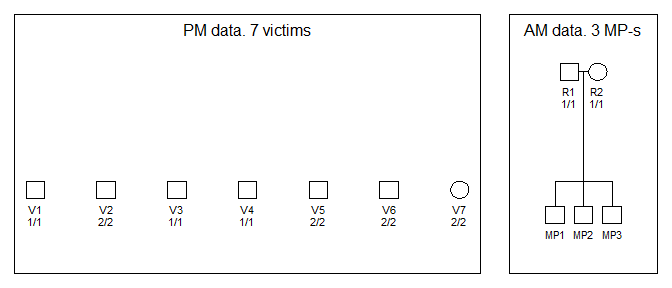

<!-- README.md is generated from README.Rmd. Please edit that file -->

# The dvir (Disaster Victim Identification) library

We assume that DNA profiles are available from victim samples (post
mortem, pm data) and reference families (ante mortem, am, data) with
missing persons (MP-s). There may be several samples from the same
victim, potentially of low quality leading to *drop-outs*. The problem
is to identify the MP-s. Some (or all) victims may not be among the
MP-s. Similarly, there may be MP-s not in the list of victims. A search
strategy is implemented. All victims are initially tried, one at a time,
in all MP positions. Results are sorted according to the likelihood and
assignments with a LR (compared to the null likelihood) below a user
specified limit are omitted from further search. If mutations are
modelled all LR-s will typically be positive and the limit must be
specified to a negative number to include all possibilities in the
future search. Based on this initial screening, all possible assignments
of victims are generated. Note that only a subset, possibly none, of
victims may be mapped to MP-s. The resulting list of assignments may be
prohibitively large and for this reason it possible to restrict the
search by specifying that only the `nbest` assignments for each victim
be considered.

## Installation

To get the latest version, install from GitHub as follows:

``` r
 # First install devtools if needed
if(!require(devtools)) install.packages("devtools")

# Install dvir from GitHub
devtools::install_github("thoree/dvir")
```

The implementation relies heavily on the `ped` suite of R-libraries, in
particular the `forrel` and `pedmut` libraries which can be installed by
running

``` r
devtools::install_github("magnusdv/forrel")
devtools::install_github("magnusdv/pedmut")
```

## Load libraries

``` r
library(dvir)
#> Loading required package: arrangements
#> Loading required package: pedtools
#> Loading required package: forrel
#> Loading required package: pedprobr
```

## Example 1

We consider the following example

``` r
library(pedtools)
n = 7
ids.from = paste("V", 1:n, sep = "")
sex = c(rep(1, n-1), 2)
df = data.frame(id = ids.from, fid = 0, mid = 0, sex = sex,
                a1 = c(1,2,1,1,2,2,2),
                a2 = c(1,2,1,1,2,2,2))
locus_annotations = list(alleles = 1:3, afreq = c(1, 1, 1)/3)
from = as.ped(df, locusAttributes = locus_annotations)
to = nuclearPed(3, father = "R1", mother = "R2", children= c("MP1","MP2","MP3"))
m = marker(to, "R1" = 1, "R2" = 1,   alleles = 1:3, afreq = c(1, 1, 1)/3, name = "a1")
to = addMarkers(to, m)
plotPedList(list(from, to), marker = 1, 
            titles = c("PM data. 7 victims", "AM data. 3 MP-s"))
```

<!-- -->

We do not consider mutations or other artefacts. We assume that copies
of victim samples have been identified and merged so that without extra
information like (*todo:* add age), there are six symmetric solutions.
If we knew the age ordering, for instance
\(age(V1) > age(V2) > age(V3)\), then \(MP1=V1, MP2=V2, MP3=V3\).
Recall, the convention that individuals are ordered left to right in the
pedigree based on age.

### The number of assignments

The number of assignments is

``` r
m = ncomb(1,0,6,3)
m
#> [1] 229
```

as is checked by

``` r
MPs = c("MP1", "MP2","MP3")
# see function generateMoves below
moves = list(V1 = c("V1", MPs ), V2 = c("V2", MPs ), V3 = c("V3", MPs ), V4 = c("V4", MPs),
             V5 = c("V5", MPs ), V6 = c("V6", MPs ), V7 = "V7" )
a = expand.grid.nodup(moves)
stopifnot(length(a) == m)
```

### The search

The search and the ten best solutions

``` r
res = global(from, to, MPs, moves = NULL, limit = -1, verbose = F)
res[1:10,]
#>    V7  V1 V2  V3  V4 V5 V6    loglik  LR  posterior
#> 43 V7 MP3 V2 MP2 MP1 V5 V6 -13.18335 729 0.12326682
#> 46 V7 MP2 V2 MP3 MP1 V5 V6 -13.18335 729 0.12326682
#> 56 V7 MP3 V2 MP1 MP2 V5 V6 -13.18335 729 0.12326682
#> 59 V7 MP1 V2 MP3 MP2 V5 V6 -13.18335 729 0.12326682
#> 69 V7 MP2 V2 MP1 MP3 V5 V6 -13.18335 729 0.12326682
#> 72 V7 MP1 V2 MP2 MP3 V5 V6 -13.18335 729 0.12326682
#> 15 V7 MP2 V2 MP1  V4 V5 V6 -15.38057  81 0.01369631
#> 16 V7 MP3 V2 MP1  V4 V5 V6 -15.38057  81 0.01369631
#> 22 V7 MP1 V2 MP2  V4 V5 V6 -15.38057  81 0.01369631
#> 23 V7 MP3 V2 MP2  V4 V5 V6 -15.38057  81 0.01369631
```

We generate the assignments based on the PM data (`from` below), AM data
(`to` below), and the names of the missing persons (`MPs` below)

``` r
moves = generateMoves(from, to, MPs)
```

We can optionally check the input

``` r
test1 = checkDVI(from, to,  MPs, moves)
```
