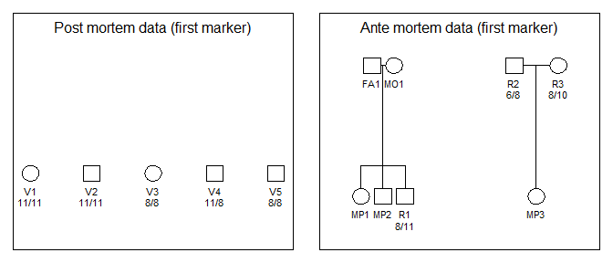

<!-- README.md is generated from README.Rmd. Please edit that file -->
The dvir (Disaster Victim Identification) library
=================================================

DNA profiles are available from victims (post mortem, pm, data) and reference families (ante mortem, am, data) with missing persons (mp-s). The problem is to identify the mp-s. Some (or all) victims may not be among the mp-s. Similarly, there may be mp-s not in the list of victims. A search strategy is implemented. All victims are initially tried, one at a time, in all mp positions. Results are sorted according to the likelihood and moves with a LR (compared to the null likelihood) below a user specified limit are omitted from further search. If mutations are modelled all LR-s will typically be positive and the limit must be specified to a negative number to include all possibilities in the future search. Based on this initial screening, all possible moves of victims are generated. Note that only a subset, possibly none, of victims may be mapped to mp-s. The resulting list of moves may be prohibitively large and for this reason it possible to restrict the search by specifying that only the `nbest` moves for each victim be considered.

In addition, a forward stepwise approach, conceptually similar to variable selection in regression analysis, is implemented in the function `forward`. This approach is generally faster, but may fail to find a solution.

Installation
------------

To get the lastest version, install from GitHub as follows:

``` r
 # First install devtools if needed
if(!require(devtools)) install.packages("devtools")

# Install mut2 from GitHub
devtools::install_github("thoree/dvir")
```

The implementation relies heavily on the `pedtools` suite of R-libraries, in particular the `forrel` library which can be installed by running

``` r
devtools::install_github("magnusdv/forrel")
```

Example 1
---------

The data is simulated and summarised by the below figure


-------------------------------------

One of the 13 CODIS, TPOX, is included in the plot. Five victims are shown to the left. The reference families are on the right hand side. Based on this marker, we see for instance that the only possibility for `MP3` is `V3` as mutations are disregarded initially in this example. The data has been prepared,loaded and the first part of analysisis given below:

``` r
library(dvir)
library(forrel)
data(dvi.data)
from = dvi.data$pm
to = dvi.data$am
ids.from = dvi.data$vict
ids.to = dvi.data$miss
tab = reduce(from, to, ids.from, ids.to, limit = 0)
tab
#>   from  to           lik          lik0           LR
#> 1   V1 MP1 4.265076e-130 2.625697e-132 1.624360e+02
#> 2   V2 MP2 1.525893e-129 2.625697e-132 5.811381e+02
#> 3   V3 MP3 2.857873e-123 2.625697e-132 1.088424e+09
#> 4   V3 MP1 1.964035e-134 2.625697e-132 7.480050e-03
#> 5   V4 MP2 4.854342e-135 2.625697e-132 1.848782e-03
#> 6   V5 MP2 3.516507e-135 2.625697e-132 1.339266e-03
```

The null likelihood, `lik0`=2.625697e-132 is the likelihood prior to any attempt of identification. This can also be calculated directly using only the `forrel`library

``` r
prod(forrel::LR(list(from, to), 1)$likelihoodsPerSystem)
#> [1] 2.625697e-132
```

The table shows that all victims can be assigned a mp. For `V3` there are two possibilities and these are ranked. Based on the table, all possible solutions are generated and evaluated and the three best solutions are shown below

``` r
res2 = dviSearch(from, to,  ids.from, ids.to,  nbest = NULL, extend = TRUE)
res2[1:3,]
#>    V1  V2  V3           lik          lik0           LR
#> 1 MP1 MP2 MP3 4.418114e-117 2.625697e-132 1.682644e+15
#> 2  V1 MP2 MP3 1.660819e-120 2.625697e-132 6.325247e+11
#> 3 MP1  V2 MP3 4.642212e-121 2.625697e-132 1.767992e+11
```

The first line gives the optimal solution and corresponds to the one from which data was simulated:`MP1 = V1`, `MP2 = V2`, `MP3 = V3`. The second line differs by not identifying `V1`. In this case, there is no need to limit the search. However, for large problems, the variable `nbest`can as mentioned be used to limit the search to the the `nbest` options for each victim. If `extend = FALSE` alle victims must be among the missing persons.

### Mutations

Next the data is modified to allow for mutations, a `proportional` mutation model with mutation rate 0.005. The identification `MP3 = V1` is no longer excluded and likelihoods are slightly changed. The three best solutions are

``` r
res = dviSearch(from, to,  ids.from, ids.to,  nbest = NULL, extend = TRUE)
res[1:3,]
#>    V1  V2  V3           lik          lik0           LR
#> 1 MP1 MP2 MP3 3.917874e-117 2.625697e-132 1.492127e+15
#> 2  V1 MP2 MP3 1.570387e-120 2.625697e-132 5.980838e+11
#> 3 MP1  V2 MP3 4.367990e-121 2.625697e-132 1.663554e+11
```

### Simulation

First victims are simulated as unrelated:

``` r
from = setAlleles(from, alleles =0)
sim = profileSim(c(from, to), N = 1, ids = ids.from, 
                      conditions = 1:13,seed = 123)[[1]]
dviSearch(sim[1:5], sim[6:7],  ids.from, ids.to,  nbest = NULL, extend = TRUE)
#>   V1 V2 V3 V4 V5           lik          lik0 LR
#> 1 V1 V2 V3 V4 V5 2.856272e-131 2.856272e-131  1
```

Next victims are simulated as `MP1`,`MP2` and `MP3`.

``` r
from = setAlleles(from, alleles = 0, ids = ids.from[1:3])
sim = profileSim(c(from, to), N = 1, ids = ids.to, 
                      conditions = 1:13, seed = 123)[[1]]
g = getAlleles(sim, ids = ids.to)
sim = setAlleles(sim, ids = ids.to, alleles = 0)
rownames(g) = ids.from[1:3]
sim = setAlleles(sim, ids = rownames(g), alleles = g)
dviSearch(sim[1:5], sim[6:7],  ids.from, ids.to,  nbest = NULL, extend = TRUE)[1:3,]
#>    V1  V2  V3          lik         lik0           LR
#> 1 MP1 MP2 MP3 3.960090e-78 1.39828e-100 2.832115e+22
#> 2  V1 MP2 MP3 1.343041e-83 1.39828e-100 9.604954e+16
#> 3 MP1  V2 MP3 2.161936e-84 1.39828e-100 1.546139e+16
```
