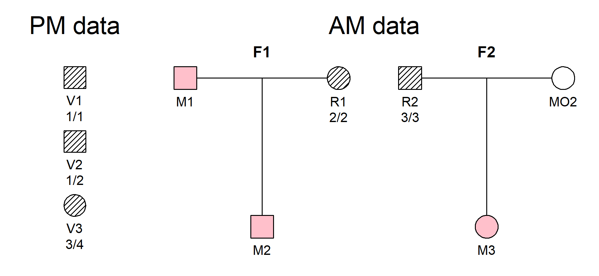
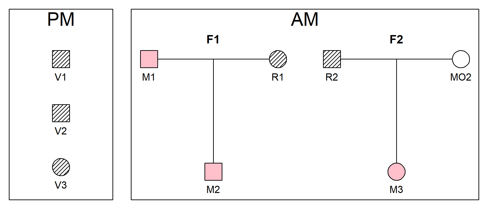
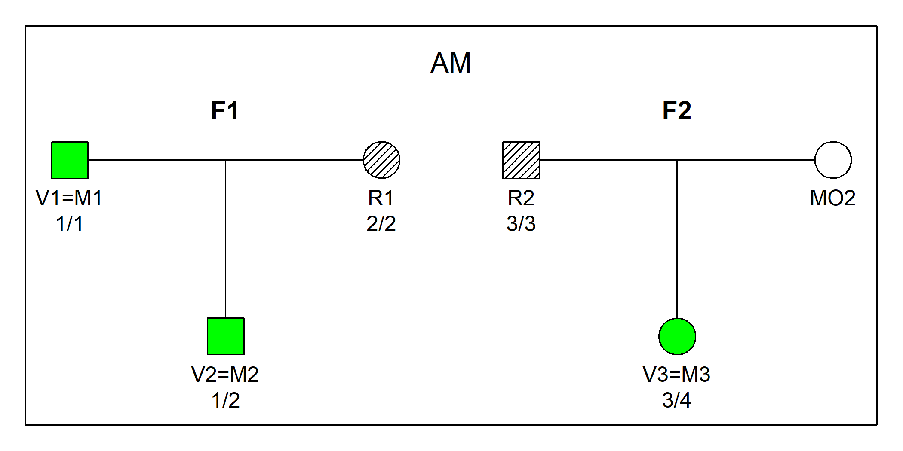

<!-- README.md is generated from README.Rmd. Please edit that file -->

<!-- badges: start -->

[](https://CRAN.R-project.org/package=dvir)
[](https://cran.r-project.org/package=dvir)
[](https://cran.r-project.org/package=dvir)
<!-- badges: end -->

# Disaster Victim Identification in R

The purpose of **dvir** is to implement state-of-the-art algorithms for
DNA-based disaster victim identification (DVI). In particular, **dvir**
performs *joint* identification of multiple victims.

The methodology and algorithms of **dvir** are described in [Vigeland &
Egeland (2021): DNA-based Disaster Victim
Identification](https://www.nature.com/articles/s41598-021-93071-5).

The **dvir** package is part of the
[pedsuite](https://magnusdv.github.io/pedsuite/), a collection of R
packages for pedigree analysis. Much of the machinery behind **dvir** is
imported from other pedsuite packages, especially **pedtools** for
handling pedigree data, and **forrel** for the calculation of likelihood
ratios. A comprehensive presentation of these packages, and much more,
can be found in the book [Pedigree Analysis in
R](https://shop.elsevier.com/books/pedigree-analysis-in-r/vigeland/978-0-12-824430-2).

## Installation

To get the current official version of **dvir**, install from CRAN as
follows:

``` r
install.packages("dvir")
```

Alternatively, the latest development version may be obtained from
GitHub:

``` r
# install.packages("remotes")
remotes::install_github("magnusdv/dvir")
```

## Example

We illustrate joint DVI analysis using a toy example from the paper
(Vigeland & Egeland, 2021), shown in the plot below. Three victim
samples (V1, V2, V3) are to be matched against three missing persons
(M1, M2, M3) in two different families.



The hatched symbols indicate genotyped individuals. In this simple
example we consider only a single marker, with 10 equifrequent alleles
denoted 1, 2,…, 10. The available genotypes are shown in the figure.

DNA profiles from victims are referred to as *post mortem* (PM) data,
while the *ante mortem* (AM) data contains profiles from the reference
individuals R1 and R2.

### Assignments

A possible solution to the DVI problem is called an *assignment*. In our
toy example, there are *a priori* 14 possible assignments respecting the
individuals’ sex:

| V1  | V2  | V3  |
|:---:|:---:|:---:|
| \*  | \*  | \*  |
| \*  | \*  | M3  |
| \*  | M1  | \*  |
| \*  | M1  | M3  |
| \*  | M2  | \*  |
| \*  | M2  | M3  |
| M1  | \*  | \*  |
| M1  | \*  | M3  |
| M1  | M2  | \*  |
| M1  | M2  | M3  |
| M2  | \*  | \*  |
| M2  | \*  | M3  |
| M2  | M1  | \*  |
| M2  | M1  | M3  |

Each row indicates the missing persons corresponding to V1, V2 and V3
(in that order) with `*` meaning *not identified*. For example, the
first line contains the *null model* corresponding to none of the
victims being identified, while the last line gives the assignment where
`(V1, V2, V3) = (M1, M2, M3)`, For each assignment `a` we can calculate
the likelihood, denoted `L(a)`. The null likelihood is denoted `L0`.

Our aim in this brief tutorial is to perform the following tasks using
**dvir**:

1)  Rank the assignments according to how likely they are. For each
    assignment `a` we compute the LR comparing it to the null model:
    `LR = L(a)/L0`.
2)  Find the *posterior pairing probabilities* `P(V_i = M_j | data)` for
    all pairs of victims and missing persons.

### The data

The pedigrees and genotypes for this toy example are available within
**dvir** as a built-in dataset, under the name `example2`.

``` r
library(dvir)
```

``` r
example2
#> DVI dataset: 
#>  3 victims (2M/1F): V1, V2, V3
#>  3 missing (2M/1F): M1, M2, M3
#>  2 reference individuals: R1, R2
#>  2 pedigrees: 
#> Markers: 1
```

Internally, all DVI datasets in **dvir** have the structure of a list,
with elements `pm` (the victim data), `am` (the reference data) and
`missing` (a vector naming the missing persons): We can inspect the data
by printing each object. For instance, in this case `am` is a list of
two pedigrees:

``` r
example2$am
#> [[1]]
#>  id fid mid sex  L1
#>  M1   *   *   1 -/-
#>  R1   *   *   2 2/2
#>  M2  M1  R1   1 -/-
#> 
#> [[2]]
#>   id fid mid sex  L1
#>   R2   *   *   1 3/3
#>  MO2   *   *   2 -/-
#>   M3  R2 MO2   2 -/-
```

Each pedigree is printed in so-called *ped format*, with columns `id`
(ID label), `fid` (father’s ID, or `*` if no father is included), `mid`
(mother’s ID), `sex` (1 = male; 2 = female) and `L1` (genotypes at locus
`L1`).

The code generating this dataset can be found in the github repository
of **dvir**, more specifically here:
<https://github.com/magnusdv/dvir/blob/master/data-raw/example2.R>.

A great way to inspect a DVI dataset is to plot it with the function
`plotDVI()`.

``` r
plotDVI(example2)
```



The `plotDVI()` function offers many parameters for tweaking the plot;
see the help page `?plotDVI()` for details.

### Joint identification

The `jointDVI()` function performs joint identification of all three
victims, given the data. It returns a data frame ranking all assignments
with nonzero likelihood:

``` r
jointRes = jointDVI(example2, verbose = FALSE)

# Print the result
jointRes
#>    V1 V2 V3    loglik  LR   posterior LR0
#> 1  M1 M2 M3 -16.11810 250 0.718390805   5
#> 2  M1 M2  * -17.72753  50 0.143678161   5
#> 3   * M2 M3 -18.42068  25 0.071839080   1
#> 4  M1  * M3 -20.03012   5 0.014367816   1
#> 5   * M1 M3 -20.03012   5 0.014367816   1
#> 6   * M2  * -20.03012   5 0.014367816   1
#> 7   *  * M3 -20.03012   5 0.014367816   1
#> 8  M1  *  * -21.63956   1 0.002873563   1
#> 9   * M1  * -21.63956   1 0.002873563   1
#> 10  *  *  * -21.63956   1 0.002873563   1
```

The output shows that the most likely joint solution is (V1, V2, V3) =
(M1, M2, M3), with an LR of 250 compared to the null model.

The function `plotSolution()` shows the most likely solution:

``` r
plotSolution(example2, jointRes, marker = 1)
```



By default, the plot displays the assignment in the first row of
`jointRes`. To examine the second most likely, add `k = 2` (and so on to
go further down the list).

### Posterior pairing probabilities

Next, we compute the posterior pairing (and non-pairing) probabilities.
This is done by feeding the output from `jointDVI()` into the function
`Bmarginal()`.

``` r
Bmarginal(jointRes, example2$missing, prior = NULL)
#>            M1        M2        M3          *
#> V1 0.87931034 0.0000000 0.0000000 0.12068966
#> V2 0.01724138 0.9482759 0.0000000 0.03448276
#> V3 0.00000000 0.0000000 0.8333333 0.16666667
```

Here we used a default flat prior for simplicity, assigning equal prior
probabilities to all assignments.

We see that the posterior pairing probabilities for the most likely
solution are

- *P*(V1 = M1 \| data) = 0.88,
- *P*(V2 = M2 \| data) = 0.95,
- *P*(V3 = M3 \| data) = 0.83.

------------------------------------------------------------------------
