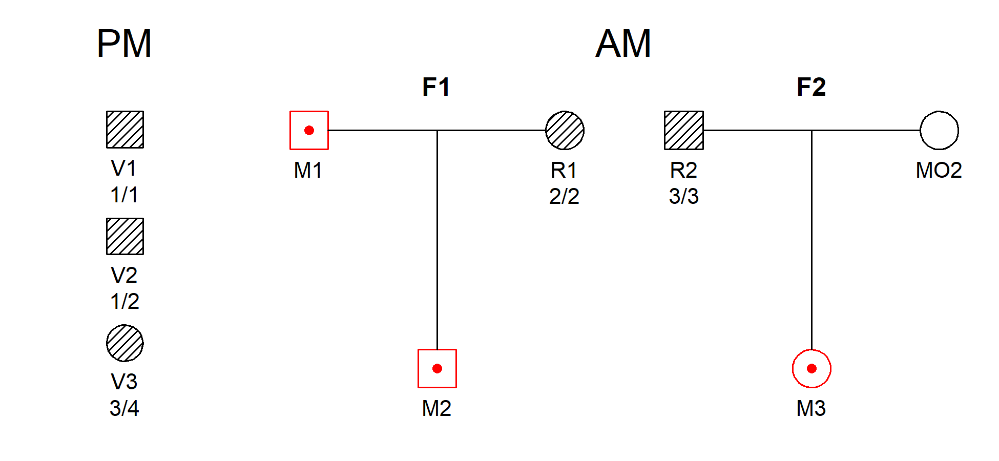
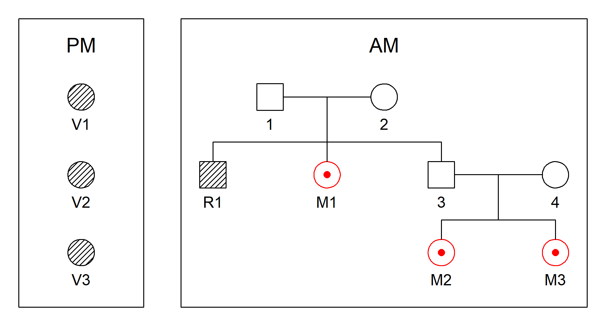

<!-- README.md is generated from README.Rmd. Please edit that file -->

<!-- badges: start -->

[](https://CRAN.R-project.org/package=dvir)
[](https://cran.r-project.org/package=dvir)
[](https://cran.r-project.org/package=dvir)
<!-- badges: end -->

# Disaster Victim Identification in R

The purpose of **dvir** is to implement state-of-the-art algorithms for
DNA-based disaster victim identification (DVI). In particular, **dvir**
performs *joint* identification of multiple victims.

The methodology and algorithms of **dvir** are described in

- Egeland & Vigeland (2025): [Kinship cases with partially specified
  hypotheses](https://doi.org/10.1016/j.fsigen.2025.103270)
- Vigeland & Egeland (2021): [Joint DNA-based Disaster Victim
  Identification](https://www.nature.com/articles/s41598-021-93071-5)

The **dvir** package is part of the
[pedsuite](https://magnusdv.github.io/pedsuite/), a collection of R
packages for pedigree analysis. Much of the machinery behind **dvir** is
imported from other pedsuite packages, especially **pedtools** for
handling pedigree data, and **forrel** for the calculation of likelihood
ratios. A comprehensive presentation of these packages, and much more,
can be found in the book [Pedigree Analysis in
R](https://shop.elsevier.com/books/pedigree-analysis-in-r/vigeland/978-0-12-824430-2).

## Installation

To get the current official version of **dvir**, install from CRAN as
follows:

``` r
install.packages("dvir")
```

Alternatively, the latest development version may be obtained from
GitHub:

``` r
# install.packages("remotes")
remotes::install_github("magnusdv/dvir")
```

## Joint DVI analysis

``` r
library(dvir)
```

We illustrate joint DVI analysis using a toy example from Vigeland &
Egeland (2021), shown below. Three victim samples (V1, V2, V3) are to be
matched against three missing persons (M1, M2, M3) from two families.



The hatched symbols indicate genotyped individuals. This simple example
uses a single marker with 10 equifrequent alleles denoted 1, 2, …, 10.
The observed genotypes are shown in the figure.

DNA profiles from victims are referred to as *post mortem* (PM) data,
while the *ante mortem* (AM) data contain profiles from the reference
individuals, R1 and R2.

The function `dviJoint()` performs a joint likelihood search over all
valid assignments.

``` r
joint = dviJoint(example2)
#> DVI dataset: 
#>  3 victims (2M/1F): V1, V2, V3
#>  3 missing (2M/1F): M1, M2, M3
#>  2 reference individuals: R1, R2
#>  2 pedigrees: F1, F2
#> Markers: 1 
#> Number of assignments: 14 (exact)
```

The output contains the log-likelihood of each of the 14 assignments,
and likelihood ratios (LRs) comparing the most likely solution with each
of the others. Thus the first row has `LR = 1`, while larger values
indicate less likely assignments:

|     | V1  | V2  | V3  |  loglik |  LR | M1  | M2  | M3  |
|:----|:----|:----|:----|--------:|----:|:----|:----|:----|
| 1   | M1  | M2  | M3  | -16.118 |   1 | V1  | V2  | V3  |
| 2   | M1  | M2  | \*  | -17.728 |   5 | V1  | V2  | \*  |
| 3   | \*  | M2  | M3  | -18.421 |  10 | \*  | V2  | V3  |
| 4   | M1  | \*  | M3  | -20.030 |  50 | V1  | \*  | V3  |
| 5   | \*  | M1  | M3  | -20.030 |  50 | V2  | \*  | V3  |
| 6   | \*  | M2  | \*  | -20.030 |  50 | \*  | V2  | \*  |
| 7   | \*  | \*  | M3  | -20.030 |  50 | \*  | \*  | V3  |
| 8   | \*  | M1  | \*  | -21.640 | 250 | V2  | \*  | \*  |
| 9   | M1  | \*  | \*  | -21.640 | 250 | V1  | \*  | \*  |
| 10  | \*  | \*  | \*  | -21.640 | 250 | \*  | \*  | \*  |
| 11  | M2  | M1  | M3  |    -Inf | Inf | V2  | V1  | V3  |
| 12  | M2  | M1  | \*  |    -Inf | Inf | V2  | V1  | \*  |
| 13  | M2  | \*  | M3  |    -Inf | Inf | \*  | V1  | V3  |
| 14  | M2  | \*  | \*  |    -Inf | Inf | \*  | V1  | \*  |

The columns V1, V2 and V3 give the PM-oriented assignment: each victim
is either paired with a missing person or remains unassigned (`"*"`).
The columns M1, M2 and M3 give the AM-oriented view of the same
assignments.

We see that the most likely joint solution is V1 = M1, V2 = M2 and V3 =
M3.

## Automated DVI workflow

For complete DVI analysis, the main function is `dviSolve()`. It
combines several steps, including exclusions, undisputed
identifications, pairwise LR calculations, joint analysis of unresolved
families, and conclusions based on generalised likelihood ratios (GLRs).

We illustrate this with the built-in dataset `fire`, which includes
three victim samples and three missing persons from the same family. The
function `plotDVI()` gives an overview:

``` r
plotDVI(fire, style = 2)
```



Here is the complete workflow using LR threshold 10 000:

``` r
res = dviSolve(fire, detailedOutput = TRUE, threshold = 1e4, verbose = TRUE)
#> 
#> ------ Checking dataset  [+0.0s | 0.0s] ----------
#> 
#> Ok
#> 
#> ------ Nonidentifiable MPs  [+0.0s | 0.0s] -------
#> 
#> None 
#> 
#> ------ Exclusions, iteration 1  [+0.0s | 0.0s] ---
#> 
#> No exclusions
#> 
#> ------ Undisputed, iteration 1  [+0.0s | 0.0s] ---
#> 
#> No change; breaking loop
#> 
#> ------ AM-driven: Simple families  [+0.1s | 0.1s] 
#> 
#> 0 simple families
#> 
#> ------ AM-driven: Complex families  [+0.0s | 0.1s] 
#> 
#> 1 complex family: F1
#> 
#> Number of assignments: 34 (exact)
#> 
#>   Family Missing Sample       LR        GLR      Conclusion                            Comment
#> 1     F1      M1     V1 121.3476   70582.39     Match (GLR)                  Joint: {M1,M2,M3}
#> 2     F1      M2  V2/V3       NA 2947149.10 Symmetric match Full siblings: {M2, M3} = {V2, V3}
#> 3     F1      M3  V2/V3       NA 2947149.10 Symmetric match Full siblings: {M2, M3} = {V2, V3}
#> 
#> ------ PM-driven: Remaining victims  [+0.2s | 0.4s] 
#> 
#> No remaining victims
#> 
#> ------ Analysis complete  [+0.0s | 0.4s] ---------
```

The output contains AM-oriented and PM-oriented summary tables,
including conclusions and comments. With `detailedOutput = TRUE`, the
result also contains the pairwise LR matrix, the exclusion matrix, and
the joint tables used in the analysis:

#### `res$AM`

| Family | Missing | Sample | LR | GLR | Conclusion | Comment |
|:---|:---|:---|---:|---:|:---|:---|
| F1 | M1 | V1 | 121.35 | 70582.39 | Match (GLR) | Joint: {M1,M2,M3} |
| F1 | M2 | V2/V3 | NA | 2947149.10 | Symmetric match | Full siblings: {M2, M3} = {V2, V3} |
| F1 | M3 | V2/V3 | NA | 2947149.10 | Symmetric match | Full siblings: {M2, M3} = {V2, V3} |

#### `res$PM`

| Sample | Missing | Family | LR | GLR | Conclusion | Comment |
|:---|:---|:---|---:|---:|:---|:---|
| V1 | M1 | F1 | 121.35 | 70582.39 | Match (GLR) | Joint: {M1,M2,M3} |
| V2 | M2/M3 | F1 | 36.56 | 2947149.10 | Symmetric match | Full siblings: {V2, V3} = {M2, M3} |
| V3 | M2/M3 | F1 | 1.31 | 2947149.10 | Symmetric match | Full siblings: {V2, V3} = {M2, M3} |

#### `res$LRmatrix`

|     |      M1 |      M2 |      M3 |
|:----|--------:|--------:|--------:|
| V1  | 121.348 | 398.582 | 398.582 |
| V2  |   0.583 |  36.564 |  36.564 |
| V3  |   0.002 |   1.312 |   1.312 |

#### `res$exclusionMatrix`

|     |  M1 |  M2 |  M3 |
|:----|----:|----:|----:|
| V1  |   0 |   0 |   0 |
| V2  |   0 |   0 |   0 |
| V3  |   0 |   0 |   0 |

#### `res$jointTables` (truncated)

| V1  | V2  | V3  |  loglik |         LR | M1  | M2  | M3  |
|:----|:----|:----|--------:|-----------:|:----|:----|:----|
| M1  | M2  | M3  | -257.73 |       1.00 | V1  | V2  | V3  |
| M1  | M3  | M2  | -257.73 |       1.00 | V1  | V3  | V2  |
| \*  | M2  | M3  | -268.90 |   70582.39 | \*  | V2  | V3  |
| \*  | M3  | M2  | -268.90 |   70582.39 | \*  | V3  | V2  |
| M2  | M1  | M3  | -272.63 | 2947149.10 | V2  | V1  | V3  |
| M3  | M1  | M2  | -272.63 | 2947149.10 | V2  | V3  | V1  |

### Conclusion

In the `fire` example, V1 is identified as M1 by joint GLR analysis
(Egeland & Vigeland, 2025). The two remaining victims are matched to the
two missing full siblings M2 and M3, but the data do not distinguish
between the two sibling assignments. This is reported as a symmetric
match.
