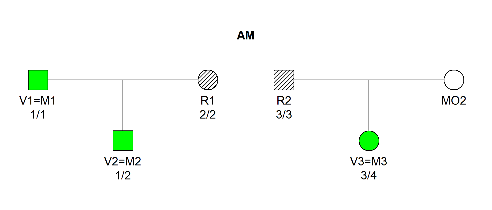

<!-- README.md is generated from README.Rmd. Please edit that file -->
<!-- badges: start -->

[](https://CRAN.R-project.org/package=dvir)
[](https://cran.r-project.org/package=dvir)
[](https://cran.r-project.org/package=dvir)
<!-- badges: end -->

# Disaster Victim Identification in R

The purpose of **dvir** is to implement state-of-the-art algorithms for
DNA-based disaster victim identification (DVI). In particular, **dvir**
performs *joint* identification of multiple victims.

The methodology and algorithms of **dvir** are described in [Vigeland &
Egeland (2021): DNA-based Disaster Victim
Identification](https://www.researchsquare.com/article/rs-296414/v1).

The **dvir** package is part of the **ped suite**, a collection of R
packages for relatedness pedigree analysis. Much of the machinery behind
**dvir** is imported from other **ped suite** packages, especially
[pedtools](https://github.com/magnusdv/pedtools) for handling pedigrees
and marker data, and [forrel](https://github.com/magnusdv/forrel) for
the calculation of likelihood ratios. A comprehensive presentation of
these packages, and much more, can be found in the recently published
book [Pedigree Analysis in
R](https://www.elsevier.com/books/pedigree-analysis-in-r/vigeland/978-0-12-824430-2).

## Installation

To get the current official version of **dvir**, install from CRAN as
follows:

``` r
install.packages("dvir")
```

Alternatively, the latest development version may be obtained from
GitHub:

``` r
 # First install devtools if needed
if(!require(devtools)) install.packages("devtools")

# Install dvir from GitHub
devtools::install_github("thoree/dvir")
```

## Tutorial example

In the following we will use a toy DVI example from the
[paper](https://www.researchsquare.com/article/rs-296414/v1) (see above)
to illustrate how to use **dvir**.

To get started, we load the **dvir** package.

``` r
library(dvir)
#> Loading required package: pedtools
```

### Introduction

We consider the DVI problem shown below, in which three victim samples
(V1, V2, V3) are to be matched against three missing persons (M1, M2,
M3) belonging to two different families.


The hatched symbols indicate genotyped individuals. In this simple
example we consider only a single marker, with 10 equifrequent alleles
denoted 1, 2,…, 10. The available genotypes are shown in the figure.

DNA profiles from victims are generally referred to as *post mortem*
(PM) data, while the *ante mortem* (AM) data contains profiles from the
reference individuals R1 and R2.

### Assignments

A possible solution to the DVI problem is called an *assignment*. In our
toy example, there are *a priori* 14 possible assignments, which can be
listed as follows:

    #>    V1 V2 V3
    #> 1   *  *  *
    #> 2   *  * M3
    #> 3   * M1  *
    #> 4   * M1 M3
    #> 5   * M2  *
    #> 6   * M2 M3
    #> 7  M1  *  *
    #> 8  M1  * M3
    #> 9  M1 M2  *
    #> 10 M1 M2 M3
    #> 11 M2  *  *
    #> 12 M2  * M3
    #> 13 M2 M1  *
    #> 14 M2 M1 M3

Each row indicates the missing persons corresponding to V1, V2 and V3
(in that order) with `*` meaning *not identified*. For example, the
first line contains the *null model* corresponding to none of the
victims being identified, while the last line gives the assignment where
`(V1, V2, V3) = (M1, M2, M3)`, For each assignment `a` we can calculate
the likelihood, denoted `L(a)`. The null likelihood is denoted `L0`.

### Goals

We consider the following to be the two main goals of the DVI analysis:

1)  Rank the assignments according to how likely they are. We measure
    this by calculating the LR comparing each assignment `a` to the null
    model: `LR = L(a)/L0`.
2)  Find the *posterior pairing probabilities* `P(Vi = Mj | data)` for
    all combinations of `i,j = 1,2,3`, and the *posterior non-pairing
    probabilities* `P(Vi = '*' | data)` for all `i = 1, 2, 3`.

### The data

The pedigrees and genotypes for this toy example are available within
**dvir** as a built-in dataset, under the name `example2`.

``` r
example2
#> DVI dataset:
#>  3 victims: V1, V2, V3
#>  3 missing: M1, M2, M3
#>  2 typed refs: R1, R2
#>  2 reference families
```

Internally, all DVI datasets in **dvir** have the structure of a list,
with elements `pm` (the victim data), `am` (the reference data) and
`missing` (a vector naming the missing persons): We can inspect the data
by printing each object. For instance, in this case `am` is a list of
two pedigrees:

``` r
example2$am
#> [[1]]
#>  id fid mid sex  L1
#>  M1   *   *   1 -/-
#>  R1   *   *   2 2/2
#>  M2  M1  R1   1 -/-
#> 
#> [[2]]
#>   id fid mid sex  L1
#>   R2   *   *   1 3/3
#>  MO2   *   *   2 -/-
#>   M3  R2 MO2   2 -/-
```

Note that the two pedigrees are printed in so-called *ped format*, with
columns `id` (ID label), `fid` (father), `mid` (mother), `sex` (1 =
male; 2 = female) and `L1` (genotypes at locus `L1`).

The appendix contains code for generating this dataset from scratch.

The function `plotDVI()` may be used to produce a graphical overview of
a DVI dataset. For example, the following command produces a plot
similar to the one shown above in the Introduction:

``` r
plotDVI(example2, marker = 1)
```

### Calculation

The `jointDVI()` function performs joint identification of all three
victims, given the data. It returns a data frame ranking all assignments
with nonzero likelihood:

``` r
jointRes = jointDVI(example2, verbose = FALSE)

# Print the result
jointRes
#>    V1 V2 V3    loglik  LR   posterior
#> 1  M1 M2 M3 -16.11810 250 0.718390805
#> 2  M1 M2  * -17.72753  50 0.143678161
#> 3   * M2 M3 -18.42068  25 0.071839080
#> 4  M1  * M3 -20.03012   5 0.014367816
#> 5   * M1 M3 -20.03012   5 0.014367816
#> 6   * M2  * -20.03012   5 0.014367816
#> 7   *  * M3 -20.03012   5 0.014367816
#> 8  M1  *  * -21.63956   1 0.002873563
#> 9   * M1  * -21.63956   1 0.002873563
#> 10  *  *  * -21.63956   1 0.002873563
```

The output shows that the most likely joint solution is (V1, V2, V3) =
(M1, M2, M3), with an LR of 250 compared to the null model.

Next, we compute the posterior pairing (and non-pairing) probabilities.
This is done by feeding the output from `jointDVI()` into the function
`Bmarginal()`.

``` r
Bmarginal(jointRes, example2$missing, prior = NULL)
#>            M1        M2        M3          *
#> V1 0.87931034 0.0000000 0.0000000 0.12068966
#> V2 0.01724138 0.9482759 0.0000000 0.03448276
#> V3 0.00000000 0.0000000 0.8333333 0.16666667
```

Here we used a default flat prior for simplicity, assigning equal prior
probabilities to all assignments.

we see that the posterior pairing probabilities for the most likely
solution are

- *P*(V1 = M1 \| data) = 0.88,
- *P*(V2 = M2 \| data) = 0.95,
- *P*(V3 = M2 \| data) = 0.83.

### Plot the solution

The function `plotSolution()` shows the most likely solution:

``` r
plotSolution(example2, jointRes, marker = 1, title = NULL)
```



By default, the plot displays the assignment in the first row of
`jointRes`. To examine the second most likely, add `k = 2` (and so on to
go further down the list).

------------------------------------------------------------------------

### Appendix: Generating the dataset from scratch

For completeness, here is one way of generating the `example2` dataset
from scratch within R.

``` r
# Load pedtools for pedigree manipulation
library(pedtools)

# Attributes of the marker locus
loc = list(name = "L1", alleles = 1:10, afreq = rep(0.1, 10))

### 1. PM data

pm = list(
    singleton("V1", sex = 1),
    singleton("V2", sex = 1),  
    singleton("V3", sex = 2)
  ) |> 
  addMarker(V1 = "1/1", V2 = "1/2", V3 = "3/4", locusAttr = loc)

### 2. AM data

am = list(
    nuclearPed(father = "M1", mother = "R1",  child = "M2"),
    nuclearPed(father = "R2", mother = "MO2", child = "M3", sex = 2)
  ) |> 
  addMarker(R1 = "2/2", R2 = "3/3", locusAttr = loc)

### 3. Missing persons
missing = c("M1", "M2", "M3")

### 4. Create DVI object
dvi = dviData(pm = pm, am = am, missing = missing)
```

The complete dataset now looks as follows.

``` r
dvi
#> DVI dataset:
#>  3 victims: V1, V2, V3
#>  3 missing: M1, M2, M3
#>  2 typed refs: R1, R2
#>  2 reference families
```
